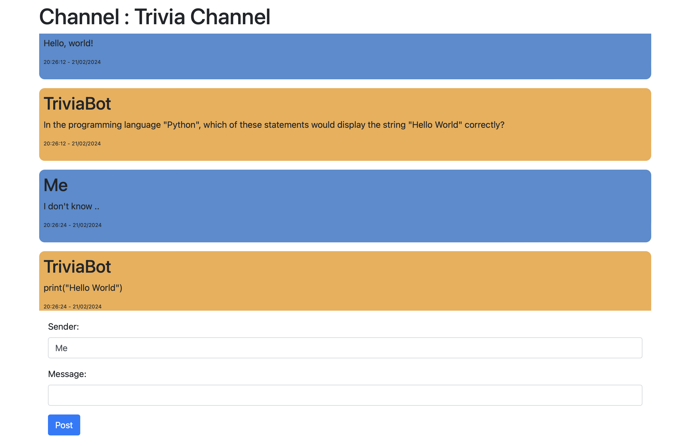

# Distributed Message Board

This is a distributed message board application that allows users to post messages, get trivia via bots and view messages posted by others. It is mainly built using Flask.

## Features

- Accessing channels via hub
- Posting messages
- Viewing messages
- Default Trivia Channel with Bot replying

## Installation

1. Clone the repository
2. Install the dependencies in requirements.txt
3. See Usage below

## Usage

1.

	python hub.py

2.

	python trivia_channel.py

3.

	flask --app trivia_channel.py register
	
4.

	python client.py

## Screenshot

